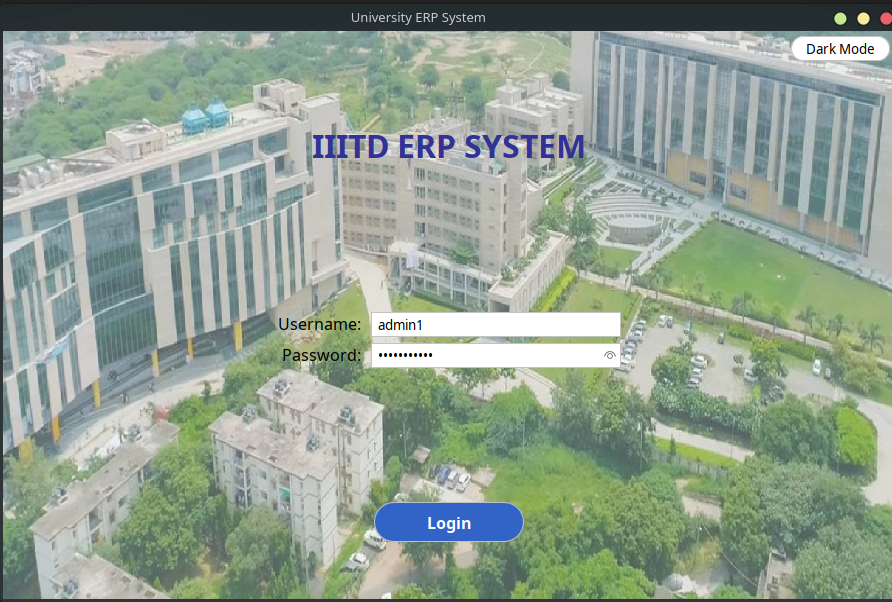
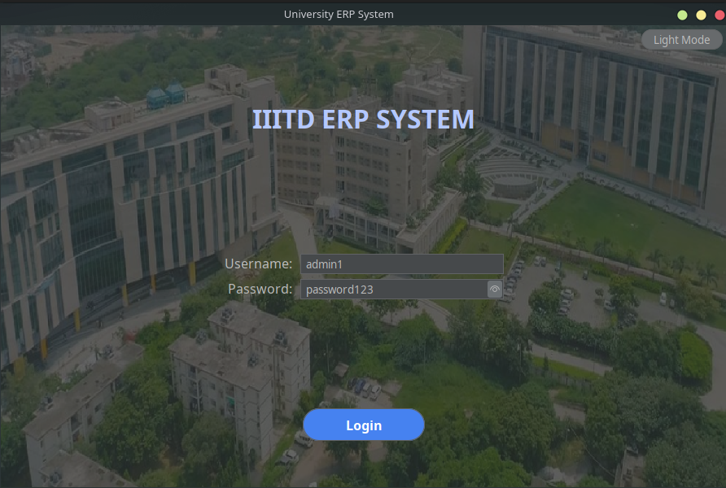
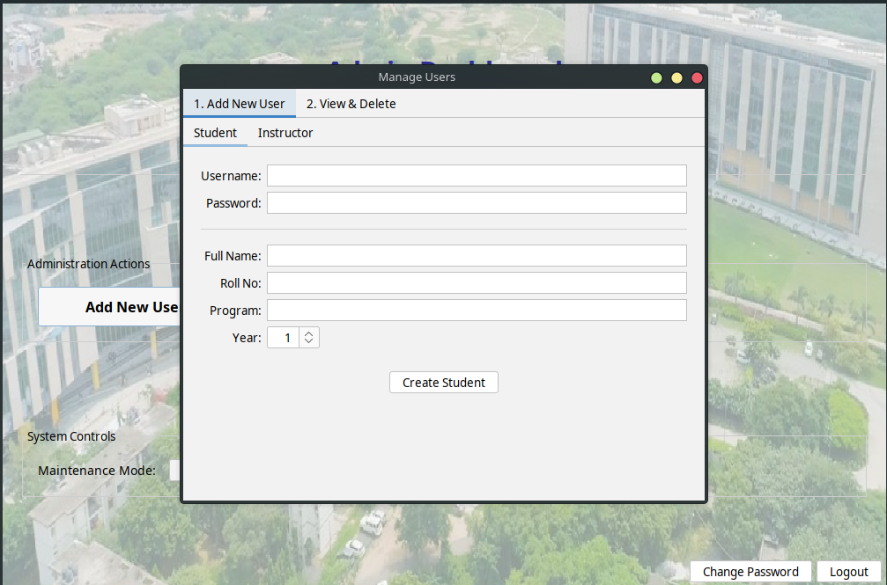
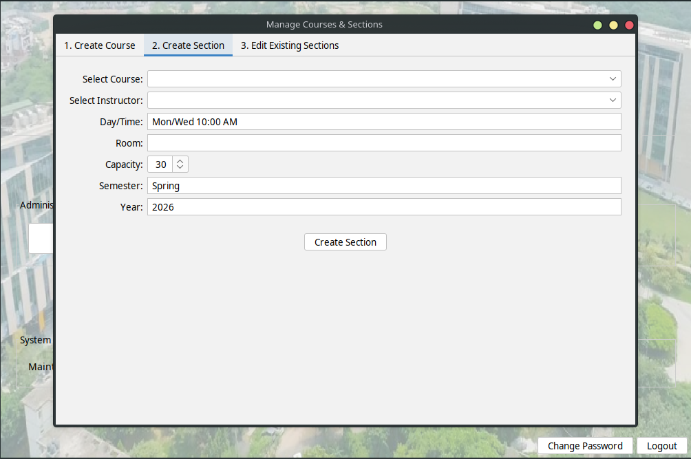
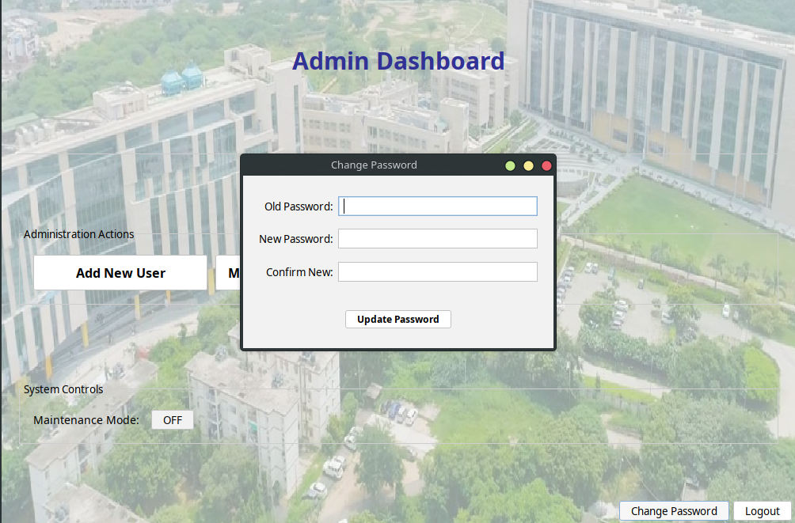
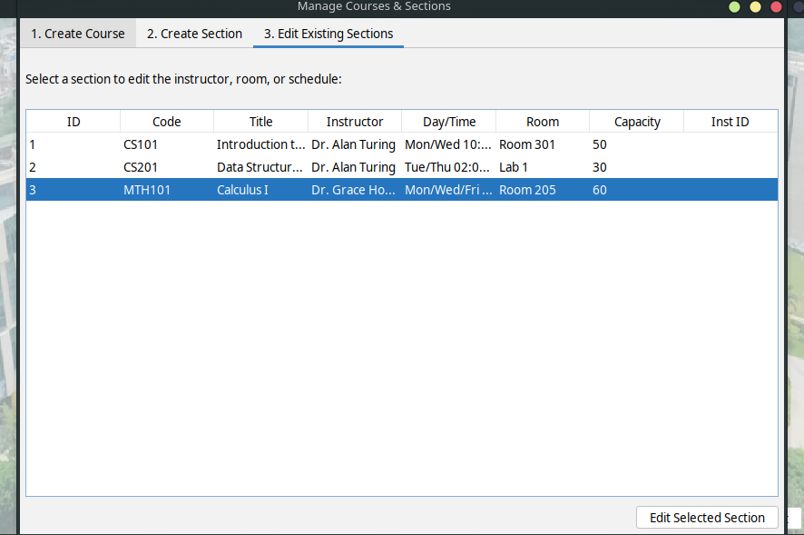
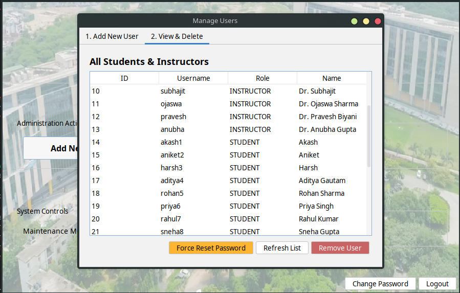
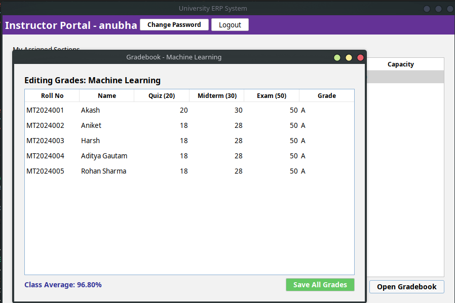
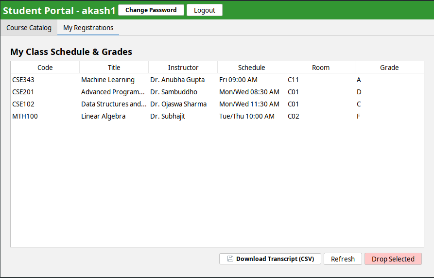
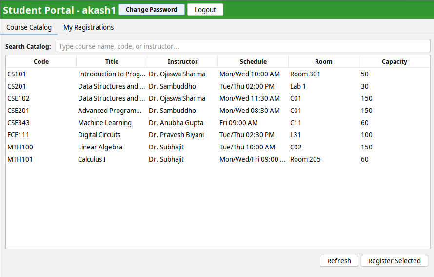

# University ERP Desktop Application

A secure, role-based academic management system developed using Java Swing, JDBC, and MySQL/MariaDB.

This comprehensive desktop application streamlines university department operations, handling the complete lifecycle of academic management, including user authentication, course enrollment, section management, and grading.

### Technology Stack

* **Language:** Java (JDK 21)
* **GUI Framework:** Java Swing (FlatLaf for modern UI rendering, MigLayout for responsive design)
* **Database Management:** MySQL / MariaDB via standard JDBC
* **Connection Pooling:** HikariCP
* **Security:** jBCrypt
* **Build System:** Maven (maven-shade-plugin)
* **Architecture:** MVC Pattern (Model-View-Controller)

### Key Features

* **Role-Based Access Control (RBAC):** Distinct interfaces and privileges for three user types:
    * **Admins:** Manage user profiles, system configurations, courses, and sections.
    * **Instructors:** Manage assigned course sections and input student grades.
    * **Students:** Browse the course catalog, manage enrollments, and view academic transcripts.
* **Secure Authentication:** Passwords are cryptographically hashed using BCrypt.
* **Automated Bootstrapping:** Application automatically verifies and inserts default seed users upon initial execution.
* **Data Integrity:** Fully normalized relational database schema with enforced foreign key constraints and cascading deletions.

---

## Screenshots

<details>
<summary>Click to expand and view application screenshots</summary>
<br>

<div align="center">
  
  
  
  
  
  
  
  
  
  
</div>

</details>

---

## Setup & Installation

### 1. Prerequisites

* **Java Development Kit (JDK):** Version 21 or higher
* **Apache Maven:** Version 3.8 or higher
* **Database:** MySQL 8.0+ or MariaDB 10.5+

### 2. Database Initialization
The application requires two logical databases (`university_auth` and `university_erp`). Create the schemas and structural tables by executing the provided SQL script against your database server:
```bash
mysql -u root -p < schema_setup.sql

```

### 3. Application Configuration

Update the `src/main/resources/application.properties` file with your local database credentials. This file also dictates the default user accounts that will be automatically generated upon the application's first launch.

```properties
# --- Database Connection ---
db.auth.url=jdbc:mysql://localhost:3306/university_auth
db.erp.url=jdbc:mysql://localhost:3306/university_erp
db.username=your_db_username
db.password=your_db_password

# --- Default Seed Users ---
seed.admin.username=admin1
seed.admin.password=password123
seed.instructor.username=inst1
seed.instructor.password=password123
seed.student.username=stu1
seed.student.password=password123

```

---

## Compilation & Execution

### Building from Source

Compile the application and bundle all dependencies into a single executable JAR using Maven. Execute this command in the project root:

```bash
mvn clean package

```

### Injecting Demo Data (Optional)

To evaluate the system with a fully populated academic environment, execute the demonstration data seeder. This utility safely injects instructors, courses, active sections, enrolled students, and realistic gradebook data. This is optional, it was used just to test the application while developing.

```bash
mvn exec:java -Dexec.mainClass="edu.univ.erp.util.DemoSeedData"

```

### Running the Application

Launch the precompiled executable JAR from the `target/` directory:

```bash
java -jar target/univ-erp-java-swing-executable.jar

```

---

## Contributors

* **Harsh Panchal**
* **Aniket Kumar Rai**

```

```